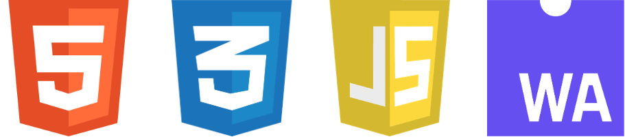
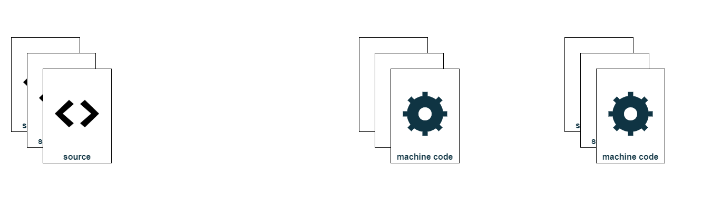
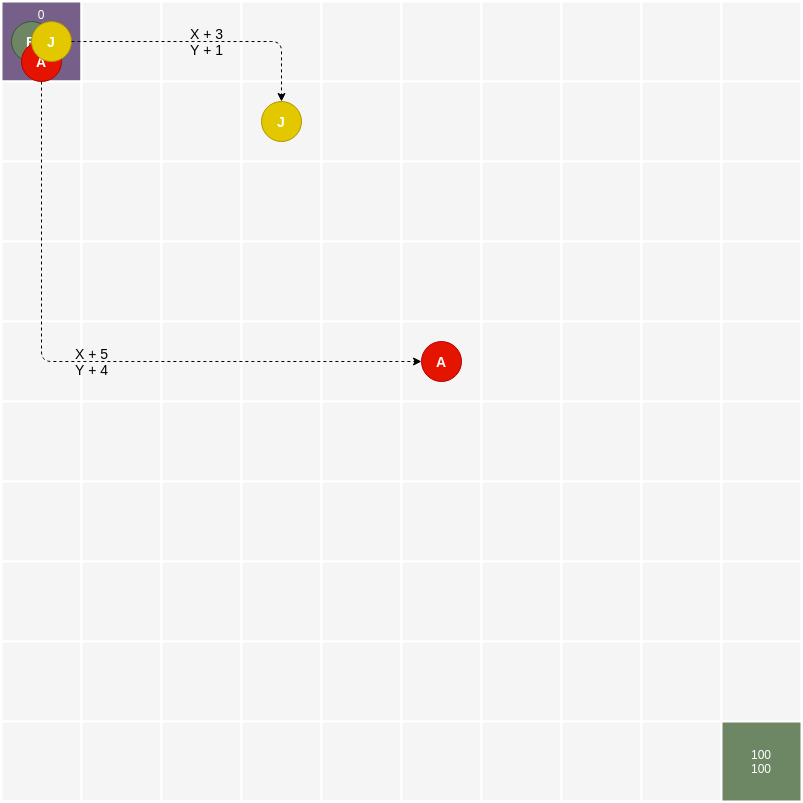
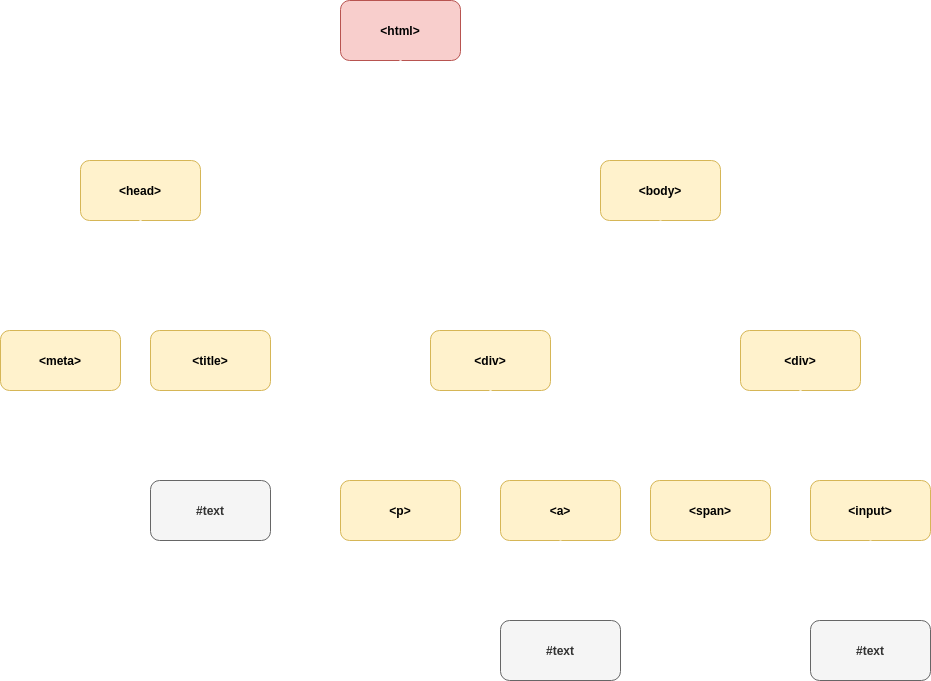
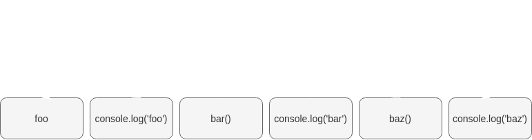
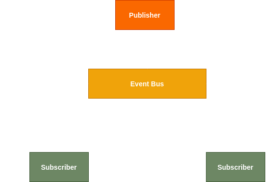
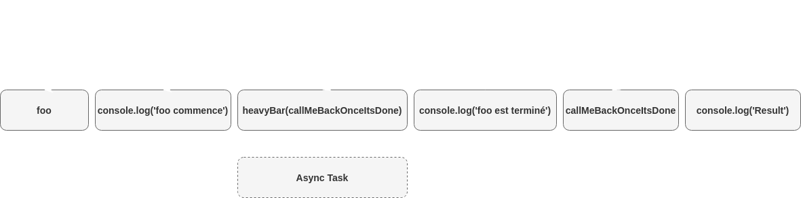

---

theme : "night"
customTheme: "custom"
transition: "slide"
highlightTheme: "monokai"
logoImg: "images/javascript_logo.png"
slideNumber: false
title: "Javascript"

---

# Javascript


--

## Plan

|           | Module                                                  | Cours   | TD     |
| :-------: |  ------------------------------------------------------ | :-----: | :----: |
| 01        | Introduction                                            | 1h      | 1h     |
| 02        | Les bases du langage et les fonctions                   | 1h      | 1h     |
| 03        | Les objets et les tableaux                              | 1h      | 1h     |
| 04        | Manipulation du DOM                                     | 1h      | 1h     |
| 05        | Programmation évènementielle                            | 1h      | 1h     |
| **Total** |                                                         | **5h**  | **5h** |

---

## Module 01
### Introduction

--

### Historique

--

#### Un langage de programmation pour les navigateurs

Créé chez [Netscape](https://fr.wikipedia.org/wiki/Netscape_Navigator) en 1995
par [Brendan Eich](https://fr.wikipedia.org/wiki/Brendan_Eich) 


Inspiré par [Java](https://en.wikipedia.org/wiki/Java_(software_platform)) mais pour le [Web](https://en.wikipedia.org/wiki/World_Wide_Web)


--

#### Infographie


- 1997 : Standardisé par [Ecma International](https://www.ecma-international.org/)
- 1999 : Popularisé grâce à [Internet Explorer 5](https://fr.wikipedia.org/wiki/Internet_Explorer_5)
- 2009 : Maturité avec [ES5](https://www.w3schools.com/js/js_es5.asp)
- 2015 : Changement majeur avec [ES6](https://www.w3schools.com/js/js_es6.asp)
- 2016, 2017, 2018... : 1 version /an


--

#### [W3C](https://www.w3.org/)

World Wide Web Consortium \
standardise le Web



--

### Usages

--

#### Initialement pour apporter un peu de dynamicité aux pages HTML


--

#### Aujourd'hui plus de [30 moteurs JavaScript]((https://en.wikipedia.org/wiki/List_of_ECMAScript_engines))
ouvrent beaucoup de possibilités
- [V8](https://v8.dev/) (Chrome, Node.js)
- [SpiderMonkey](https://developer.mozilla.org/en-US/docs/Mozilla/Projects/SpiderMonkey) (Firefox)
- [Chakra](https://github.com/microsoft/ChakraCore) (IE/Edge)
- [Carakan](https://dev.opera.com/blog/carakan/) (Opera)
- [Espruino](https://www.espruino.com/) (IoT)
- [Duktape](https://duktape.org/) (IoT)
- ...

--

#### Une vaste communauté et une grande popularité


--

#### Des applications Web


[Vue](https://vuejs.org/),
[React](https://reactjs.org/),
[Svelte](https://svelte.dev/),
[Angular](https://angular.io/),
[Ember](https://emberjs.com/),
...


--

#### Des applications Desktop


[Electron](https://www.electronjs.org/),
[Nw.js](https://nwjs.io/),
...


--

#### Des Applications Mobiles


[React native](https://reactnative.dev/),
[Ionic](https://ionicframework.com/),
...


--

#### Des applications Serveur


[Express](https://expressjs.com/),
[Nest](https://nestjs.com/),
[Hapi](https://hapi.dev/),
...

--

#### Des CLI


[Oclif](http://oclif.io/),
[Yeoman](https://yeoman.io/),
[Inquirer](https://github.com/SBoudrias/Inquirer.js/)
...

--

#### Des Outils (transpiler, packaging...)


[Webpack](https://webpack.js.org/),
[Babel](https://babeljs.io/),
[Eslint](https://eslint.org/),
[Jest](https://jestjs.io/),
[TestCafe](https://devexpress.github.io/testcafe/)
...

--

### Découverte du langage

--

#### Un langage "haut-niveau"

- Forte abstraction du système

- Concepts abstraits (variables, tableaux, opérations arithmétiques, fonctions...)

- Syntaxe naturelle (anglais)

- Gestion automatique de la mémoire

--

#### Un langage interprèté

~~Compilé~~



Interprèté


--

#### Faiblement typé

JavaScript définit des types (String, Number, Boolean...)

mais est très permissif sur leur manipulation

```javascript
// Variable de type Number
let myVar = 12;

// Qui peut être réassignée avec un type String
myVar = 'a string';

// JavaScript peut convertir lui-même les types selon les cas 
4 + '7';      // '47'
4 * '7';      // 28
2 + true;     // 3
false - 3;    // -3

```

--

#### Gestion automatique de la mémoire (Garbage Collection)
~~`malloc`~~ & ~~`free`~~

<br>

La mémoire est
- **allouée** lors de la création des objets
- **libérée** lorsque ceux-ci ne sont plus utilisés

<br>

```javascript
// Allocation lors de la déclaration
let myString = 'azerty';

// Désallocation au déréférencement
myString = null;
```

--

#### Intégration dans une page HTML

```html
<html>
    <head>

        <!-- Embedded CSS -->
        <style>p { color: red; }</style>

        <!-- External CSS -->
        <link href="my-style.css" rel="stylesheet">

    </head>
    <body>

        <!-- Embedded JavaScript -->
        <script>alert('Boom!');</script>

        <!-- External JavaScript -->
        <script src="my-script.js"></script>

    </body>
</html>
```

--

### Les variables

--

#### Qu'est-ce qu'une variable ?

Une variable est un contenant utilisé pour enregistrer une donnée

Une variable représente un concept

(un utilisateur, un panier d'achat...)

--

#### Déclarer une variable
[`let`](https://www.w3schools.com/js/js_let.asp)

```javascript
// Déclaration d'une variable
let var1;

// Assignation d'une variable
var1 = 'init value';

// Déclaration & assignation d'une variable
let var2 = 'init value';
```

--

#### Déclarer une variable
[`const`](https://www.w3schools.com/js/js_const.asp)

```javascript
// Déclaration & initialisation d'une variable
// qui ne contiendra qu'une seule valeur
const var1 = 'init value';

// Erreur de syntaxe -> const doit être assignée
const var2;

// Erreur de syntaxe -> const ne peut pas être réassignée
var1 = 'new value';
```

--

### Les types primitifs

--

#### Les booléens
[`boolean`](https://www.w3schools.com/js/js_booleans.asp)

```javascript
// Booléen vrai
const var1 = true;

// Booléen faux
const var2 = false;
```

--

#### Les chaînes de caractères
[`string`](https://www.w3schools.com/js/js_string_methods.asp)

```javascript
// Chaîne de caractères délimitée par des guillemets simples
const var1 = 'a string';

// Chaîne de caractères délimitée par des guillemets doubles
const var2 = "a string";


// Longueur d'une chaîne de caractères
console.log('abcde').length;                         // Output -> 5


// Les Chaînes de caractères possèdent de nombreuses méthodes

console.log("Hi! How are you?".toUpperCase());       // Output -> HI! HOW ARE YOU?

console.log("Hi! How are you?".substring(4, 11));    // Output -> How are 

console.log("Hi! How are you?".replace('o', 'X'));   // Output -> Hi! HXw are you?

console.log("Hi! How are you?".replace(/o/g, 'X'));  // Output -> Hi! HXw are yXu?
```

--

#### Les nombres
[`number`](https://www.w3schools.com/js/js_number_methods.asp)

```javascript
// Nombre entier positif (< 2^53 -1)
const var1 = 10;

// Nombre entier négatif (< -2^53 +1)
const var2 = -10;

// Nombre décimal positif (< 2^53 -1)
const var3 = 12.45;

// Nombre décimal négatif (< -2^53 +1)
const var4 = -12.45;


// Les nombres possèdent quelques méthodes

console.log(123.45.toString());       // Output -> '123.45'
console.log(123.45.toFixed(1));       // Output -> 123.4
```

--

#### Les autres types primitifs
[`undefined`](https://www.w3schools.com/jsref/jsref_undefined.asp)
[`null`](https://www.w3schools.com/js/js_mistakes.asp)
[`NaN`](https://www.w3schools.com/jsref/jsref_nan.asp)

```javascript
// undefined
let undefinedVar;                       // undefined car non assignée
console.log(undefinedVar);              // Output -> undefined

// null
const nullVar = null;                   // null est une vraie valeur
                                        // assignée à la variable (pas de GC)
console.log(undefinedVar);              // Output -> null

// NaN (Not a Number)
console.log(Number.parseInt('5'));      // Output -> 5
console.log(Number.parseInt('Hi!'));    // Output -> NaN
console.log(10 / 2);                    // Output -> 5
console.log('Hi!' / 2);                 // Output -> NaN
```

--

### Labs


--

### lab/01/01
#### Récupérer le contenu de la formation

1. Installer [Git](https://git-scm.com/)

2. Créer un compte sur [Github](https://github.com)

3. Communiquer l'adresse email du compte créé

4. Cloner le dépôt Git de la formation ([github.com/fmartinou/training-javascript](https://github.com/fmartinou/training-javascript))

5. Ouvrir la présentation `training-javascript/course/index.html`

--

### lab/01/02
#### Installer et configurer l'IDE

1. Télécharger et installer [Visual Studio Code](https://code.visualstudio.com/)

2. Installer les extensions suivantes
    * [ESLint](https://marketplace.visualstudio.com/items?itemName=dbaeumer.vscode-eslint)
    * [Vetur](https://marketplace.visualstudio.com/items?itemName=octref.vetur)

3. Ouvrir le repo Github de la formation dans Visual Studio Code

--

### lab/01/03
#### Découverte des outils pour Développeurs des navigateurs

1. Télécharger et installer [Google Chrome](https://www.google.com/chrome)

2. Ouvrir la page d'accueil de l'Université [Paul Sabatier](https://www.univ-tlse3.fr/)

3. Ouvrir les outils de développement de Chrome (_F12_) et explorer les fonctionnalités (Eléments, Console, Sources...)

4. Dans la console, appliquer les fragments de code suivants

```javascript
window.alert('Salut !');

console.log('Salut !');

window.open('https://media.giphy.com/media/LPgFwCQg4HQBvPihcn/giphy.gif');

document.getElementsByClassName('moteur-de-recherche-card')[0].style = 'background-image: url(https://bit.ly/2wZL7I2)';
```

--

### lab/01/04
#### Découverte de Visual Studio Code

1. Ouvrir le fichier index.html dans VsCode et le navigateur

2. Compléter les différentes méthodes et tester depuis le navigateur

3. Modifier la page pour externaliser le code JavaScript dans un fichier `script.js`

---

## Module 02
### Les bases du langage et les fonctions

--

### Les opérateurs

--

#### Les opérateurs arithmétiques
` + - * / ** %`

```javascript
// Addition
console.log(100 + 5);               // Output -> 105

// Soustraction
console.log(100 - 5);               // Output -> 95

// Multiplication
console.log(100 * 5);               // Output -> 500

// Exponentiel
console.log(5 ** 2);                // Output -> 25

// Modulo (reste de la division euclidienne)
console.log(5 % 2);                 // Output -> 1

// Incrément (equivalent à i = i + 1)
let i = 0;
console.log(i++);                   // Output -> 1

// Décrément (equivalent à i = i - 1)
let j = 0;
console.log(j--);                   // Output -> -1
```

--

#### Les opérateurs sur les chaînes de caractères
[`+`](https://www.w3schools.com/js/js_operators.asp)
[`${}`](https://developer.mozilla.org/en-US/docs/Web/JavaScript/Reference/Template_literals)

```javascript
// Concaténation
const x = 'début';
const y = 'fin';

console.log(x + ' ' + y);      // Output -> début fin


// Interpolation
const name = 'Bob';
const age = 30;
const message = `Hello, my name is ${name} and I'm ${age}!`;
console.log(message);
// Output -> Hello, my name is Bob and I'm 30!
```

--

#### Les opérateurs d'assignation
[`=`](https://www.w3schools.com/js/js_assignment.asp)

```javascript
// Assignation simple
const x = 10;
const y = x;
console.log(y)      // Output -> 10

// Assignation avec opération arithmétique
const x = 10;
let y = 5;

y += x;             // Equivaut à y = y + x

y *= x;             // Equivaut à y = y * x

y /= x;             // Equivaut à y = y / x

y **= x;            // Equivaut à y = y **/** x

// Assignation avec concaténation d'une chaîne de caractères
const x = 'début';
let y = 'fin';
```

--

#### Les opérateurs de comparaison
[`== === != !== < > <= >=`](https://www.w3schools.com/js/js_comparisons.asp)

```javascript
// Egalité de valeur (mauvaise pratique)
console.log(1 == 1) ;            // Output -> true
console.log(1 == '1');           // Output -> true

// Egalité de valeur et de type (bonne pratique)
console.log(1 === 1);            // Output -> true
console.log(1 === '1');          // Output -> false

// Non égalité de valeur (mauvaise pratique)
console.log(1 != 2);             // Output -> true
console.log(1 != '2');           // Output -> true
console.log(1 != '1');           // Output -> false

// Non égalité de valeur et de type (bonne pratique)
console.log(1 !== 2);            // Output -> true
console.log(1 !== '2');          // Output -> true
console.log(1 !== '1');          // Output -> true

// Plus grand que
console.log(20 > 10);            // Output -> true
console.log(10 > 10);            // Output -> false

// Plus grand que ou égal
console.log(20 >= 10);           // Output -> true
console.log(10 >= 10);           // Output -> true

// Plus petit que
console.log(10 < 20);            // Output -> true
console.log(10 < 10);            // Output -> false

// Plus petit que ou égal
console.log(10 <= 20);           // Output -> true
console.log(10 <= 10);           // Output -> true
```

--

#### Les opérateurs logiques
[`&& || !`]((https://www.w3schools.com/js/js_comparisons.asp))

```javascript
const vrai1 = true;
const vrai2 = true;
const faux1 = false;
const faux2 = false;

// Opérateur ET
console.log(vrai1 && vrai2);                    // Output -> true
console.log(vrai1 && faux1);                    // Output -> false
console.log(faux1 && faux2);                    // Output -> false

// Opérateur OU
console.log(vrai1 || vrai2);                    // Output -> true
console.log(vrai1 || faux1);                    // Output -> true
console.log(faux1 || faux2);                    // Output -> false

// Opérateur Négation
console.log(!vrai1);                            // Output -> false
console.log(!faux1);                            // Output -> true

// Exemples
console.log(
    !(vrai1 && faux1) || (vrai2 || faux2)
);                                              // Output -> true
```

--

### Les conditions

--

#### Si Alors
[`if else`](https://www.w3schools.com/js/js_if_else.asp)

```javascript
if (condition) {

    // exécute si condition est vraie

} else {

    // exécute si condition est fausse

}


// Exemples de conditions

if (1 === 1)     // Vrai
if (2 > 1)       // Vrai

if (1 === 2)     // Faux
if (2 <= 1)      // Faux
```

--

#### Selon
[`switch`](https://www.w3schools.com/js/js_switch.asp)

```javascript
switch (expression) {                 // l'expression à comparer

    case 'Oranges':                   // un cas à comparer
        console.log('Oranges');       // exécute si condition est vraie
        break;                        // empêche les autres cas d'être évalués

    case 'Mangues':                   // un cas à comparer
        console.log('Mangues');       // exécute si condition est vraie

    case 'Pommes':                    // un cas à comparer
        console.log('Pommes');        // exécute si condition est vraie
        break;                        // empêche les autres cas d'être évalués

    default:                          // si pas de correspondance ou pas de break
        console.log('Oups');
}


// Exemples de conditions

switch ('Oranges'){...}               // Output -> Oranges
switch ('Mangues'){...}               // Output -> Mangues Oups
switch ('Pommes'){...}                // Output -> Pommes
switch ('Concombres'){...}            // Output -> Oups
```

--

#### Opérations ternaires
[`a ? b : c`](https://www.w3schools.com/js/js_comparisons.asp)
```javascript
condition ? /* exécute si vrai */ : /* exécute si faux */;


// Exemple de ternaire
a === b ? console.log('CONDITION VRAIE') : console.log('CONDITION FAUSSE');

// Equivaut à
if (a === b) {
    console.log('CONDITION VRAIE');
} else {
    console.log('CONDITION FAUSSE');
}


// Exemple de ternaire avec assignation
const result = a === b ? 'CONDITION VRAIE' : 'CONDITION FAUSSE';

// Equivaut à
let result = 'CONDITION FAUSSE';
if (condition) {
    result = 'CONDITION VRAIE';
}
```

--

### Les boucles

--

#### Tant que
[`while`](https://www.w3schools.com/js/js_loop_while.asp)

```javascript
while (condition) {

  // exécute tant que la condition est vraie

}


// Exemples
let i = 0;

while (i < 3) {
    i = i + 1;               
    console.log(i);          // Output -> 1 / 2 / 3
}
```

--

#### Pour
[`for`](https://www.w3schools.com/js/js_loop_for.asp)
```javascript
for (initialValue; condition; increment) {

  // exécute tant que condition est vraie

}


// Exemple
for (let i = 0; i < 3; i++) {
    console.log(i);          // Output -> 0 / 1 / 2
}
```

--

#### Continuer
[`continue`](https://www.w3schools.com/js/js_break.asp)

```javascript
for (...) {
               // début d'itération
  continue;    // suite du traitement ignorée -> passage à l'itération suivante
               // fin d'itération
}


// Exemple avec un for
for (let i = 0; i < 5; i++) {
    if (i === 2) {
        continue;
    }
    console.log(i); // Output -> 0 / 1 / 3 / 4 / 5
}


// Exemple avec un while
let i = 0;

while (i < 5) {
    i = i + 1;
    if (i === 2) {
        continue;
    }          
    console.log(i);          // Output -> 1 / 3 / 4 / 5
}
```

--

#### Stop
[`break`](https://www.w3schools.com/js/js_break.asp)

```javascript
for (...) {
           // début d'itération
  break;   // suite du traitement ignorée ET itérations suivantes ignorées
           // fin d'itération
}


// Exemple avec un for
for (let i = 0; i < 5; i++) {
    if (i === 3) {
        break;
    }
    console.log(i); // Output -> 0 / 1 / 2
}


// Exemple avec un while
let i = 0;

while (i < 5) {
    i = i + 1;
    if (i === 3) {
        break;
    }          
    console.log(i);          // Output -> 1 / 2
}
```

--

### Les fonctions

--

#### Qu'est-ce qu'une fonction ?

Un bloc de code conçu pour exécuter une tache

* réutiliser du code (écrire 1 fois, utiliser N fois)

* utiliser le même code avec des arguments différents pour produire des résultats différents

```javascript
function name(param1, param2) {

    // code à exécuter

}
```

--

#### Comment invoquer une fonction ?

```javascript
function diplaySum(number1, number2) { // la fonction définit des paramètres

    console.log(number1 + number2);

}

displaySum(1, 2); // la fonction est invoquée avec les arguments 1 et 2    Output -> 3
displaySum(3, 4); // la fonction est invoquée avec les arguments 3 et 4    Output -> 7
```

--

#### Comment retourner des données ?
[`return`](https://www.w3schools.com/jsref/jsref_return.asp)

```javascript
function computeSum(number1, number2) {

    const sum = number1 + number2;

    return sum;                         // transmet la valeur à l'appelant
                                        // et interrompt l'exécution de la méthode

    console.log('Cette ligne de code ne sera jamais exécutée !');

}

const result = computeSum(1, 2);        // la fonction est invoquée
                                        // et le retour est assigné dans result

console.log(result);                    // Output -> 3

```

--

### La portée des variables

--

#### Les scopes
[`global local`](https://www.w3schools.com/js/js_scope.asp)

* __global__ :
    * Tous les scripts et fonctions d'une page Web peuvent les accéder
    * Les variables globales sont détruites quand la page est fermée

* __local__ :
    * Seul le bloc courant peut les accéder
    * Les variables locales sont détruites quand le bloc est terminé

--

#### Exemples

```javascript
const constGlobal = 'Je suis utilisable partout';
const letGlobal   = 'Je suis utilisable partout';

function myFunction(param1) { // param1 n'existe que dans la fonction

    const constInMyFunction = 'Je n\'existe que dans la fonction';

    let letInMyFunction = 'Je n\'existe que dans la fonction';

    for (let i = 0 ; i < 5 ; i++) { // i n'existe que dans la boucle

        const constInMyLoop = 'Je n\'existe que dans la boucle';
        let     letInMyLoop = 'Je n\'existe que dans la boucle';
        var     varInMyLoop = 'Attention !!! J\'existe dans toute la fonction !!!'

    }
}
```

--

#### Le hissage
[`hoisting`](https://www.w3schools.com/js/js_hoisting.asp)

Une variable peut être utilisée avant qu'elle ait été déclarée

JavaScript "hisse" par lui-même les déclarations en haut des blocs

```javascript
letGlobal = 'xxx';           // variable utilisée avant de l'avoir déclarée

let letGlobal;               // Déclarée après l'avoir assignée

function myFunction(param1) {

    letInMyFunction = 'xxx'; // variable utilisée avant de l'avoir déclarée

    let letInMyFunction;     // Déclarée après l'avoir assignée
}
```

--

#### Expression de fonction invoquée immédiatement (IIFE)
[`Immediately Invoked Function Expression`](https://www.w3schools.com/js/js_function_definition.asp)

Empêche de polluer le scope global

```javascript
(function () { 

    const myVar = 'something';

}) ();

console.log(myVar)       // Output -> Uncaught ReferenceError: myVar is not defined
```

--

#### Les fonctions fléchées
[`() => {}`](https://www.w3schools.com/js/js_arrow_function.asp)

Elles fournissent une syntaxe plus courte \
pour la déclaration des fonctions

```javascript
// Déclaration classique
const sumFunction = function(a, b) {
    return a + b;
}


// Equivalent avec une fonction Arrow
const sumFunction = (a, b) => {
    return a + b;
}


// Equivalent avec une fonction Arrow (return implicite)
const sumFunction = (a, b) => a + b;


// !!! Attention !!!
// Dans une Arrow, this représente le propriétaire de la fonction
// Et non celui qui l'invoque !!!
```

--

### Les commentaires

--

#### Les commentaires simples
[`// /* */ /** **/`](https://www.w3schools.com/js/js_comments.asp)

```javascript
// Commentaire d'1 seule ligne
console.log('code js');

/*
Commentaire multi-ligne
ligne 1...
ligne 2...
...
*/
console.log('code js');
```

--

#### Documentation du code

[JsDoc](https://github.com/jsdoc/jsdoc) très largement inspirée de [JavaDoc](https://docs.oracle.com/en/java/javase/14/javadoc/)

Génère une documentation à partir de commentaires structurés

```javascript
/** @class Circle representing a circle. */
class Circle {
/**
 * Creates an instance of Circle.
 *
 * @constructor
 * @author: moi
 * @param {number} r The desired radius of the circle.
 */
  constructor(r) {
    /** @private */ this.radius = r
    /** @private */ this.circumference = 2 * Math.PI * r
  }

  /**
   * Returns the pre-computed circumference of the Circle.
   *
   * @return {number} The circumference of the circle.
   * @since 1.1.0
   */
  getCircumference() {
    return this.circumference
  }
}
```

--

#### Documentation du code (génération)

```javascript
// jsdoc est un module node
npm install -g jsdoc


jsdoc myScript.js // Génère la documentation html sous ./out/
```


--

#### Documentation du code (annotations)

Annotation                                              | Description
--------------------------------------------------------|-----------------------------------------------
[@author](https://jsdoc.app/tags-author.html)           | Auteur du code
[@constructor](https://jsdoc.app/tags-constructor.html) | Constructeur d'une classe
[@deprecated](https://jsdoc.app/tags-deprecated.html)   | Méthode comme dépréciée
[@exports](https://jsdoc.app/tags-exports.html)         | Elément exporté par le module
[@param](https://jsdoc.app/tags-param.html)             | Paramètre d'une fonction
[@private](https://jsdoc.app/tags-private.html)         | Elément est privé
[@returns](https://jsdoc.app/tags-returns.html)         | Valeur de retour
[@see](https://jsdoc.app/tags-see.html)                 | Référence un autre élément
[@todo](https://jsdoc.app/tags-todo.html)               | Elément non terminé
[@throws](https://jsdoc.app/tags-throws.html)           | Exception pouvant être levée par une fonction
[@version](https://jsdoc.app/tags-version.html)         | Version de la librairie

--

### Labs


--

### lab/02/01

1. Implémenter une fonction isModuloZero qui :
    * Prend 2 arguments (a et b)
    * Renvoie un message d'erreur si b est plus grand que a
    * Renvoie true si le reste de la division a/b vaut zéro

3. Tester depuis le navigateur

4. Simplifier le code avec une expression ternaire

--

### lab/02/02

1. Implémenter une fonction isItWeekendYet qui :
    * Prend 1 arguments (un jour de la semaine entre lundi et vendredi)
    * Renvoie un message indiquant si c'est bientôt le week-end

2. Tester depuis le navigateur que les messages correspondent à ceux attendus

3. Optimiser le code pour factoriser les morceaux de messages communs

--

### lab/02/03

1. Implémenter une fonction sequence qui :
    * Prend un nombre entier en argument (plage)
    * Retourne la suite suivante : \
    pour chaque nombre **pair** situé entre **-plage** et **+plage** cumule le nombre **^4**

Exemple :
```
Si
    plage = 5

Alors
    Sequence =
        (-4 * -4 * -4 * -4)
        + (-2 * -2 * -2 * -2)
        + (2 * 2 * 2 * 2)
        + (4 * 4 * 4 * 4)

Output -> 40
```

--

### lab/02/03
#### Tips

* Les nombres pairs peuvent s'obtenir grâce à un modulo
* Une boucle semble indispensable...

---

## Module 03
### Les objets et les tableaux

--

### Les objets

--

#### Qu'est-ce qu'un objet ?

Un objet est une __structure de données__ qui répond à des __messages__

* Les données qui le décrivent sont appelées des \
[__attributs__](https://en.wikipedia.org/wiki/Attribute_(computing))

* La réception d'un message provoque l'exécution d'une \
[__méthode__](https://en.wikipedia.org/wiki/Method_(computer_programming))

* Les messages qu'il peut recevoir définissent son \
[__interface__](https://en.wikipedia.org/wiki/Interface_(computing))

_Exemple : Une voiture Renault Clio Verte_
* Attributs : Marque, Modèle, Couleur...
* Méthodes : Avance, Recule, Allume les phares...


--

#### Exemples d'Objets natifs

```javascript

// Dates
const now = new Date();
console.log(now.getMonth());                    // Output -> 04
console.log(now.getFullYear());                 // Output -> 2020
console.log(now.toISOString());                 // Output -> 2020-04-05T14:11:58.470Z

// Math (méthodes statiques)
console.log(Math.max(1, 2, 3));                 // Output -> 3
console.log(Math.cos(5));                       // Output -> 0.28366218546322625

// Number (méthodes statiques)
console.log(Number.isNaN(123));                 // false
console.log(Number.isNaN('abc'));               // true
console.log(Number.parseInt('123', 10));        // 123
```

--

#### Comment définir un objet en JavaScript ?
[`{}`](https://www.w3schools.com/js/js_objects.asp)

__JSON__ (JavaScript Object Notation)

```javascript
const clioGreen = {

    // Attributs

    brand: 'Renault',

    model: 'Clio',

    color: 'Green',

    horsePower: 86,

    // Méthodes (une méthode est juste un attribut de type Function ;)

    moveForward:      function(coordinateX, coordinateY) { /* implémentation */ },

    switchHeadLights: function(state)                    { /* implémentation */ },

};
```

--

#### Comment manipuler l'état d'un objet ?
[`obj.prop obj['prop']`](https://www.w3schools.com/js/js_objects.asp)

```javascript
const clioGreen = {
    brand: 'Renault',
    model: 'Clio',
    color: 'Green',
    motor: {
        horsePower: 86,
        cylinder: 4,
        fuel: 'E85',
    }
};

console.log(clioGreen.brand)                // Output -> Renault
console.log(clioGreen['brand'])             // Output -> Renault
clioGreen.model = 'Twingo';                 // Modifie l'attribut

console.log(clioGreen.motor.fuel)           // Output -> E85
console.log(clioGreen['motor']['fuel'])     // Output -> E85
```

--

#### Comment invoquer une méthode d'un objet ?
[`obj.method()`](https://www.w3schools.com/js/js_objects.asp)

```javascript
const clioGreen = {
    brand: 'Renault',
    model: 'Clio',
    color: 'Green',

    moveForward: function(coordinateX, coordinateY) {
        console.log('Moving...');
    },

    switchHeadLights: function(state) {
        console.log('Swithing headlights...');
    },
};

clioGreen.moveForward(123, 456);

clioGreen.switchHeadLights('ON');

console.log(clioGreen.moveForward);      // Output -> ƒ (coordinateX, coordinateY) {}

console.log(clioGreen.moveForward.name); // Output -> moveForward

```

--

#### Le mot clé [this](https://www.w3schools.com/js/js_this.asp) dans une méthode

fait référence à l'objet propriétaire de la méthode

```javascript
const clioGreen = {
    brand: 'Renault',
    model: 'Clio',
    headLights: 'OFF',

    switchHeadLights: function(state) {

        console.log('Swithing headlights...');

        this.headLights = state;        // this référence le propriétaire 
                                        // de la fonction switchHeadLights

    },
};

console.log(clioGreen.headLights);      // Output -> OFF

clioGreen.switchHeadLights('ON');

console.log(clioGreen.headLights);      // Output -> ON
```

--

#### Visibilité des attributs et des méthodes

Tout est public !

Aucune notion de public / protected / private !

```javascript
const myObj = {
    
    publicMethod: function() {
        console.log('Is it public? Yep!');
    },

    privateMethod: function() {
        console.log('Is it private? Nope!');
    },
};

console.log(myObj.publicMethod());      // Output -> Is it public? Yep!

console.log(myObj.privateMethod());     // Output -> Is it private? Nope!
```

--

#### Le modèle prototypal
[`prototype`](https://www.w3schools.com/js/js_object_prototypes.asp)

Javascript ne se base pas sur sur un modèle à base de classes

Un prototype fournit à l'objet \
un [`constructeur`](https://www.w3schools.com/js/js_object_constructors.asp),
des [`attributs`](https://www.w3schools.com/js/js_object_properties.asp),
des [`méthodes`](https://www.w3schools.com/js/js_object_methods.asp)

```javascript
// Récupérer le constructeur de l'objet String
String.prototype.constructor


// Récupérer la définition de la méthode toUpperCase
String.prototype.toUpperCase


// Modifier la méthode toUpperCase
console.log('Hi there!'.toUpperCase()); // Output -> HI THERE!

String.prototype.toUpperCase = () => 'Hack hack hack!';

console.log('Hi there!'.toUpperCase()); // Output -> Hack hack hack!


// Ajouter une méthode à l'objet String
String.prototype.boum = () => function () { return `${this} Boum!` };

console.log('Hi there!'.boum()); // Output -> Hi there! Boum!
```

--

#### Le chainage de prototypes


--

#### Créer ses propres modèles d'objets
[`new`](https://www.w3schools.com/js/js_object_constructors.asp)

```javascript
// Un modèle de classe est juste une fonction
function Car(brand, model, color) {
    this.brand = brand;
    this.model = model;
    this.color = color;

    this.moveForward = function(x, y) {
        console.log(`I'm moving to ${x}:${y}!`);
    }
}


// Construction des objets grace au mot-clé 'new'
const greenClio = new Car('Renault', 'Clio', 'Green');
const blue208   = new Car('Peugeot', '208', 'Blue');


// Utilisation des objets
greenClio.moveForward(123, 456);
```

--

#### Les Classes (sucre syntaxique)
[`class`](https://www.w3schools.com/js/js_classes.asp)

```javascript
class Car {

    // Le Constructeur
    constructor(brand, model, color) {
        this.brand = brand;
        this.model = model;
        this.color = color;
    }

    // Une méthode
    moveForward(x, y) {
        console.log(`I'm moving to ${x}:${y}!`);
    }

    // Une méthode statique
    static whoAreYou() {
        console.log('I\'m a Car!');
    }
}

// Construction des objets grace au mot-clé 'new'
const greenClio = new Car('Renault', 'Clio', 'Green');

// Utilisation des objets
greenClio.moveForward(123, 456);

// Accès à une méthode statique
Car.whoAreYou();
```


--

#### Les Classes (héritage)
[`extends`](https://www.w3schools.com/java/ref_keyword_extends.asp)

```javascript
class Pet {

    constructor(name) { this.name = name }

    eat() {
        console.log('Miam miam!');
    }

}

class Dog extends Pet {             // extends permet de définir l'héritage

    constructor(name, breed) {

        super(name);                // super fait référence au parent
        this.breed = breed;

    }

    barf() {
        console.log('Wouaf wouaf!');
    }
}

const rex = new Dog('Rex');
console.log(rex.name):              // Output -> Rex
rex.eat();                          // Output -> Miam miam!
rex.bark();                         // Output -> Wouaf wouaf!
```

--

### Les tableaux

--

#### Qu'est-ce qu'un tableau ?

Un [objet](https://www.w3schools.com/js/js_objects.asp) qui
* stocke une [liste ordonnée dynamique](https://www.w3schools.com/js/js_arrays.asp) d'éléments

* possède des [méthodes](https://www.w3schools.com/js/js_object_methods.asp) pour manipuler ses éléments


--

#### Déclarer un tableau
[`[]`](https://www.w3schools.com/js/js_arrays.asp)

```javascript

// Exemple d'un tableau contenant des chaînes de caractères
const stringArray = [ 'Pomme', 'Poire', 'Banane' ];

// Exemple d'un tableau contenant des Objets
const objectArray = [
    { 'name': 'Pomme', 'quantity': 5},
    { 'name': 'Pomme', 'quantity': 12},
    { 'name': 'Pomme', 'quantity': 6},
];

// Exemple d'un tableau contenant des fonctions
const functionArray = [
    function(a, b) { return a + b;    },
    function()     { return 'Hello!'; },
];

// Exemple d'un tableau contenant différents types
const mishmashArray = [
    'Pomme',
    123.45,
    true,
    { 'name': 'Pomme', 'quantity': 5},
];
```

--

#### Accéder les éléments d'un tableau
[`array[i]`](https://www.w3schools.com/js/js_arrays.asp)

```javascript
const arr = [ 'One', 'Two', 'Three' ];

console.log(arr[-1]);       // Output -> undefined

console.log(arr[0]);        // Output -> One (1er élément est à l'index 0 !!!)

console.log(arr[1]);        // Output -> Two

console.log(arr[2]);        // Output -> Three

console.log(arr[3]);        // Output -> undefined
```

--

#### Modifier un élément d'un tableau
[`array[i] = x`](https://www.w3schools.com/js/js_arrays.asp)

```javascript
const arr = [ 'Pomme', 'Poire', 'Banane' ];

arr[1] = 'Kiwi'     // Remplace Poire par Kiwi
console.log(arr)    // Output -> [ 'Pomme', 'Kiwi', 'Banane' ]

arr[3] = 'Ananas'   // Ajoute Ananas en quatrième position
console.log(arr)    // Output -> [ 'Pomme', 'Kiwi', 'Banane', 'Ananas' ]

arr[5] = 'Mangue'   // Ajoute Mangue en sixième position
console.log(arr)    // Output -> [ 'Pomme', 'Kiwi', 'Banane', 'Ananas', undefined,  'Mangue' ]
```

--

#### Récupérer le nombre d'éléments d'un tableau
[`array.length`](https://www.w3schools.com/js/js_arrays.asp)

```javascript
const arr = [ 'Pomme', 'Poire', 'Banane' ];

// Récupérer la taille d'un tableau
console.log(arr.length)                 // Output -> 3

// Récupérer le dernier élément
console.log(arr[arr.length -1])         // Output -> Banane

// Itérer sur tous les éléments
for (let i = 0 ; i < arr.length ; i++) {

    console.log(arr[i])                 // Output -> Pomme puis Poire puis Banane

}
```

--

#### Convertir un tableau en chaîne de caractères
[`array.toString(delimiter)`](https://www.w3schools.com/js/js_array_methods.asp)

```javascript
const arr = [ 'Pomme', 'Poire', 'Banane' ];

// Avec delimiter par défaut (', ')
console.log(arr.toString())                 // Output -> 'Pomme, Poire, Banane'


// Avec delimiter spécifique
console.log(arr.toString(' ** '))          // Output -> 'Pomme ** Poire ** Banane'
```

--

#### Itérer sur un tableau
[`forEach`](https://www.w3schools.com/js/js_array_methods.asp)

```javascript
const arr = [ 'Pomme', 'Poire', 'Banane' ];


function logItem(item) {
    console.log(item);
}


// forEach prend en paramètre une fonction f(item)
arr.forEach(logItem);                       


// Equivaut à (fonction anonyme)
arr.forEach(function(item) {                
    console.log(item);
});


// Equivaut à (fonction Arrow)
arr.forEach(item => console.log(item));


// Equivaut à (for)
for (let i = 0 ; i < arr.length ; i++) {
    logItem(arr[i]);
}
```

--

#### Ajouter un nouvel élément dans un tableau
[`array.push(item)`](https://www.w3schools.com/js/js_array_methods.asp)

```javascript
const arr = [ 'Pomme', 'Poire', 'Banane' ];

// Ajoute un nouvel élément en fin de liste
arr.push('Mangue');             // [ 'Pomme', 'Poire', 'Banane', 'Mangue' ]


// Equivaut à
arr[arr.length] = 'Mangue';     // [ 'Pomme', 'Poire', 'Banane', 'Mangue' ]
```

--

#### Supprimer le dernier élément d'un tableau
[`array.pop()`](https://www.w3schools.com/js/js_array_methods.asp)

```javascript
const arr = [ 'Pomme', 'Poire', 'Banane' ];


console.log(arr.pop());         // Banane


console.log(arr);               // [ 'Pomme', 'Poire' ]
```

--

#### Supprimer le premier élément d'un tableau (et décaler les autres)
[`array.shift()`](https://www.w3schools.com/js/js_array_methods.asp)


```javascript
const arr = [ 'Pomme', 'Poire', 'Banane' ];


console.log(arr.shift());           // Output -> Pomme


console.log(arr);                   // Output -> [ 'Poire', 'Banane' ]
```


--

#### Ajouter un élément en premier (et décaler les autres)
[`array.unshift(item)`](https://www.w3schools.com/js/js_array_methods.asp)


```javascript
const arr = [ 'Pomme', 'Poire', 'Banane' ];


console.log(arr.unshift('Mangue')); // Output -> 4 (la nouvelle taille)


console.log(arr);               // Output -> [ 'Mangue', 'Pomme', 'Poire', 'Banane' ]
```

--

#### Ajouter / Supprimer un élément au milieu des autres
[`array.splice(i, nToDelete, newItem1, newItem2,...)`](https://www.w3schools.com/js/js_array_methods.asp)


```javascript
const arr = [ 'A', 'B', 'C', 'D', 'E', 'F', 'G', 'H' ];


// En position 4, supprimer 2 élément et ajouter 3 nouveaux éléments
const result = arr.splice(4, 2, 'X', 'Y', 'Z'));


console.log (result):   // Output -> [ 'E', 'F' ]


console.log(arr);       // Output -> ['A', 'B', 'C', 'D', 'X', 'Y', 'Z', 'G', 'H' ]
```

--

#### Concaténer des tableaux
[`array.concat(arr1, arr2, arr3, ...)`](https://www.w3schools.com/js/js_array_methods.asp)


```javascript
const arr1 = [ 'A', 'B' ];
const arr2 = [ 'C', 'D' ];
const arr3 = [ 'E', 'F' ];

// Concaténér 3 tableaux
const result = arr1.concat(arr2, arr3);


console.log (result):   // Output -> [ 'A', 'B', 'C', 'D', 'E', 'F' ]


// Les tableaux initiaux ne sont pas altérés
console.log(arr1);       // Output -> [ 'A', 'B' ]
console.log(arr2);       // Output -> [ 'C', 'D' ]
console.log(arr3);       // Output -> [ 'E', 'F' ]
```

--

#### Découper un tableau
[`array.slice(start, end)`](https://www.w3schools.com/js/js_array_methods.asp)


```javascript
const arr = [ 'A', 'B', 'C', 'D', 'E', 'F', 'G', 'H' ];


// Extrait un tableau de à partir de l'index 2 jusqu'à l'index 4
console.log(array.slice(2, 4)); // Output -> ['C', 'D', 'E']


// Si le 2ème paramètre est omis, alors découpe jusqu'à la fin
console.log(array.slice(2)); // Output -> ['C', 'D', 'E', 'F', 'G', 'H']


// Le tableau initial n'est pas altéré
console.log(arr1);       // Output -> [ 'A', 'B', 'C', 'D', 'E', 'F', 'G', 'H' ]
```

--

#### Trier un tableau
[`array.sort(item1, item2)`](https://www.w3schools.com/js/js_array_methods.asp)

```javascript
const stringArray = [ 'C', 'A', 'B', 'E', 'D'];
const numArray = [ 4, 5, 10, 6, 1, 3, 7, 8, 9, 2 ];
const objectArray = [   { 'name': 'Pomme', 'quantity': 5},
                        { 'name': 'Pomme', 'quantity': 12},
                        { 'name': 'Pomme', 'quantity': 6}];

// Tri (ordre naturel chaîne de caractères)
stringArray.sort();
console.log(stringArray);   // Output -> [ 'A', 'B', 'C', 'D', 'E' ]

numArray.sort();            // Tri faux pour des nombres
console.log(numArray);      // Output -> [ 1, 10, 2, 3, 4, 5, 6, 7, 8, 9]

// Possibilité de passer une fonction de tri f(item1, item2)
// Si la fonction retourne un nombre positif => item2 sera avant item1
// Si la fonction retourne un nombre négatif => item1 sera avant item2
// Si la fonction retourne 0                 => pas de changement
numArray.sort(function(item1, item2) {
    return item2 - item1;
});
console.log(numArray);      // Output -> [ 1, 2, 3, 4, 5, 6, 7, 8, 9, 10]

// Equivalent (Arrow)
numArray.sort((item1, item2) => return item2 - item1);

// Exemple de tri d'un tableau d'objets
objectArray.sort((fruit1, fruit2) => return fruit2.quantity - fruit1.quantity);
```

--

#### Créer un tableau en appliquant une fonction
#### sur les éléments d'un tableau existant
[`array.map()`](https://www.w3schools.com/js/js_array_methods.asp)

```javascript
const arr1 = [ 'Pomme', 'Poire', 'Banane'];


const newArray = arr1.map(function (item) {
    return {
        name: item,
        quantity: 1,
    };
});


console.log(newArray);      // Output -> 
                            // [
                            //    { name: 'Pomme',  quantity: 1},
                            //    { name: 'Poire',  quantity: 1},
                            //    { name: 'Banane', quantity: 1},
                            // ]

// Equivalent (Arrow)
const newArray = arr1.map(item => ({ name: item, quantity: 1 }));
    return {
        name: item,
        quantity: 1,
    };
});
```

--

#### Créer un tableau en appliquant un filtre
#### sur les éléments d'un tableau existant
[`array.filter()`](https://www.w3schools.com/js/js_array_methods.asp)

```javascript
const arr1 = [ -3, -2, -1, 0, 1, 2, 3 ];


const newArray = arr1.filter(function (item) {
    return item >= 0;
});


console.log(newArray);      // Output -> [ 0, 1, 2, 3 ]


// Equivalent (Arrow)
const newArray = arr1.filter(item => item >= 0);
```

--

#### Réduire un tableau à une seule valeur
[`array.reduce()`](https://www.w3schools.com/js/js_array_methods.asp)

```javascript
const arr1 = [ 0, 1, 2, 3 , 4, 5, 6];

// Exemple de fonction qui cumule toutes les valeurs
const result = arr1.reduce(function (newValue, item, index, array) {
    return newValue + item;
});


console.log(result);                                                // Output -> 21


// Equivalent (Arrow)
const newArray = arr1.reduce((newValue, item) => newValue + item);


// Il est possible de passer une valeur initiale 
console.log(arr1.reduce((newValue, item) => newValue + item), 10);  // Output -> 31
```

--

#### Tester si les valeurs du tableau respectent une condition
[`array.every( array.some()`](https://www.w3schools.com/js/js_array_methods.asp)

```javascript
const arr = [ 0, 1, 2, 3 , 4, 5, 6];


// Exemple : Est-ce que toutes les valeurs sont positives
console.log(arr.every(item => item > 0));       // Output -> false


// Exemple : Est-ce que une valeur au moins est positive
console.log(arr.some(item => item > 0));        // Output -> true
```

--

#### Trouver la position d'un élément
[`array.indexOf() array.lastIndexOf`](https://www.w3schools.com/js/js_array_methods.asp)

```javascript
const arr = [ 'Pomme', 'Poire', 'Banane','Mangue', 'Mangue', 'Ananas' ];


// Quel est la 1ère position de l'élément 'Mangue' ?
console.log(arr.indexOf(item => item === 'Mangue'));            // Output -> 3


// Quel est la dernière position de l'élément 'Mangue' ?
console.log(arr.lastIndexOf(item => item === 'Mangue'));        // Output -> 4


// Exemple : Quel est la position de l'élément 'Courgette' ?
console.log(arr.indexOf(item => item === 'Courgette'));         // Output -> -1
                                                                // (non trouvé)
```

--

#### Trouver un élément
[`array.find`](https://www.w3schools.com/js/js_array_methods.asp)

```javascript
const arr = [ 1, 5, 5, 8, 13, 21 ];


// Trouver le 1er élément plus grand que 10 ?
console.log(arr.find(item => item > 10));            // Output -> 13


// Trouver un élément qui n'existe pas ?
console.log(arr.find(item => item > 100));            // Output -> undefined


// Trouver le 1er fruit dont la quantité est supérieure à 1
console.log([
    { 'name': 'Pomme', 'quantity': 1},
    { 'name': 'Poire', 'quantity': 1},
    { 'name': 'Kiwi', 'quantity': 6},
].find(item => item.quantity > 1));                 // Output ->
                                                    // {
                                                    //      'name': 'Kiwi',
                                                    //      'quantity': 6
                                                    // }
```

--

### Passage par référence ou par valeur ?

--

#### Passage par valeur : tous les types primitifs

```javascript

function test(aString) {                // aString est une copie de valeur
    aString = aString +  ' world!';
    return aString;
}


let stringA = 'Hello';
let stringB = test(stringA);


console.log(stringA);                    // Output -> Hello
console.log(stringB);                    // Output -> Hello world!
```

--

#### Passage par référence : tous les objets

```javascript

function testObject(anObject) {         // anObject est une simple référence
    anObject.myProp = 'Here is a new value for myProp!';
    return anObject;
}


function testArray(anArray) {         // anArray est une simple référence
    anArray.push('Here is a new item!');
    return anArray;
}


let objA = { myProp: 'myValue' };
let objB = testObject(objA);
console.log(objA);                // Output -> { myProp: 'Here is a new value for myProp!' }
console.log(objB);                // Output -> { myProp: 'Here is a new value for myProp!' }


let arrA = ['a', 'b'];
let arrB = testArray(arrA);
console.log(arrA);                // Output -> ['a', 'b', 'Here is a new item!']
console.log(arrB);                // Output -> ['a', 'b', 'Here is a new item!']
```

Attention ! Les tableaux sont aussi des objets !

--

### Les opérateurs de Décomposition et de Destructuration

--

#### Opérateur de décomposition
[`spread`](https://developer.mozilla.org/fr/docs/Web/JavaScript/Reference/Op%C3%A9rateurs/Syntaxe_d%C3%A9composition)

Permet d'étendre un tableau ou un objet en plusieurs arguments

```javascript
// Fonctionne pour les tableaux
const arr1 = [1, 2, 3];
const arr2 = [...arr1, 4, 5, 6];
console.log(arr2);                          // Output -> [1, 2, 3, 4, 5, 6]


// Fonctionne pour les objets (merge)
const obj1 = { a: 'a' };
const obj2 = { ...obj1, b: 'b' };
console.log(obj2);                          // Output -> { a: 'a', b: 'b' }
```

--

#### Destructuration
[`destructuring`](https://developer.mozilla.org/fr/docs/Web/JavaScript/Reference/Op%C3%A9rateurs/Affecter_par_d%C3%A9composition)

Permet d'extraire des données d'un tableau ou d'un objet

```javascript
const arr = [1, 2, 3, 4, 5, 6];
const [a, b, c, ...rest] = arr;
console.log(a);                             // Output -> 1
console.log(b);                             // Output -> 2
console.log(c);                             // Output -> 3
console.log(rest);                          // Output -> [4, 5, 6]


// Fonctionne aussi pour les objets
const obj = { a: 'a', b: 'b', c: 'c', d: 'd' };
const { a, b, ...rest } = obj;
console.log(a);                             // a
console.log(b);                             // b
console.log(rest);                          // { c: 'c', d: 'd' }
```

--

### La gestion des erreurs

--

### Qu'est-ce qu'une erreur ? 
[`Error`](https://www.w3schools.com/jsref/jsref_obj_error.asp)

Une erreur est un [objet](https://www.w3schools.com/js/js_objects.asp) \
qui fournit de l'information lorsque quelque chose ne fonctionne pas comme attendu

```javascript
// Une erreur contient un message
const myError = new Error('Ceci n\'était pas prévu !');


// Par défaut, le nom d'une erreur est Error
console.log(myError.name)       // Output -> Error


// Il est possible de la nommer différemment
myError.name = 'MyError';
console.log(myError.name)       // Output -> MyError
```

--

### Emettre une erreur
[`throw`](https://www.w3schools.com/jsref/jsref_throw.asp)

```javascript
// Une erreur est émise avec le mot-clé throw
const myError = new Error('Ceci n\'était pas prévu !');


// Throw interrompt la pile d'exécution
throw myError;


console.log('Ce code ne sera jamais appelé !');
```

--

### Attraper une erreur
[`try {} catch {} finally {}`](https://www.w3schools.com/jsref/jsref_try_catch.asp)

```javascript
function itWillThrow() {

    throw new Error('Boum!');

}


try {                   // Le code à protéger est dans un try

    itWillThrow();

} catch (err) {         // Si une erreur se produit, elle est attrapée dans un catch

    console.log(`OMG! An error occured : ${err.message}`);

} finally {             // Toujours exécuté (qu'une erreur se produise ou non)

    console.log('Always called!');

}
```

--

### Labs


--

### lab/03/01
#### Implémenter une course avec 3 partipants qui doivent se déplacer sur une grille d'un point A à un point B.



--

### lab/03/01
#### Règles du jeu

- Les 3 participants démarrent au point A (0, 0)
- Le 1er participant qui atteint le point B (100, 100) gagne et le jeu s'arrête
- Chaque déplacement est compris de manière aléatoire entre 0 et 10 cases (en X et Y)

--

### lab/03/01
#### Course

1. Modéliser chaque joueur sous forme d'un objet qui :
    * Possède un nom
    * Possède une position sur la grille (x, y)
    * Possède une méthode pour se déplacer

2. Implémenter la méthode de déplacement
    * déplacement aléatoire compris entre 1 et 10 cases (utiliser la méthode `random` fournie)
    * affiche dans la console qui se déplace (départ et arrivée)

3. Implémenter la méthode `play`
    * déplacement de chaque joueur à tour de rôle
    * arrêt du jeu et désignation du vainqueur

--

### lab/03/02
#### Les tableaux

1. Implémenter les fonctions attendues par les différents boutons

--

### lab/03/03
#### Les erreurs

1. Implémenter une Classe `LabError` qui étend Error

2. Implémenter une fonction `sum(a, b)` qui
    * retourne la somme de a et b
    * lance une `LabError` lorsque le résultat de la somme est `NaN`

3. Implémenter une fonction `callSum(a, b)` qui
    * délègue le calcul à la fonction `sum`
    * catch les erreurs et les affiche (nom de l'erreur et message)

4. Tester avec les boutons sur la page

---

## Module 04
### Manipulation du DOM et gestion évènementielle

--

### BOM & DOM
_<small>sont sur un bateau</small>_

--

#### Qu'est-ce que le BOM ?


Le [BOM](https://www.w3schools.com/js/js_window.asp) (Browser Object Model) \
est une API qui permet au JavaScript d'interragir avec le navigateur

**Attention !**

**Ce n'est pas une API normalisée !**

--

#### Qu'est-ce que le DOM ?


Le [DOM](https://www.w3schools.com/js/js_htmldom.asp) (Document Object Model) \
est l'arbre des objets créés par le navigateur quand une page est chargée



--

#### Quel est le lien entre le BOM et le DOM ?


Le [BOM](https://www.w3schools.com/js/js_window.asp)
est une super API du
[DOM](https://www.w3schools.com/js/js_htmldom.asp)


--

#### A quoi ça sert ?


Le [DOM](https://www.w3schools.com/js/js_htmldom.asp) est une interface de programmation normalisée ([W3C](https://www.w3.org/)).

Il permet à des scripts d'intéragir avec le contenu de la page :

- Ajouter / modifier un élément
- Modifier les styles (CSS)
- Réagir à des évènements
- ...

--

#### L'API

L'[API](https://en.wikipedia.org/wiki/Application_programming_interface)
du [DOM](https://www.w3schools.com/js/js_htmldom.asp)
permet de manipuler
[des éléments](https://www.w3schools.com/js/js_htmldom_elements.asp)

Les éléments sont de simples objets JavaScript qui :
- contiennent des [méthodes](https://www.w3schools.com/js/js_object_methods.asp)

- contiennent des [propriétés](https://www.w3schools.com/js/js_object_properties.asp)

- émettent des [évènements](https://www.w3schools.com/js/js_htmldom_events.asp)

- écoutent des [évènements](https://www.w3schools.com/js/js_htmldom_events.asp)

--

#### Le document
[`document`](https://www.w3schools.com/js/js_htmldom_document.asp)

Objet racine qui contient tous les autres objets de la page

Permet notamment de chercher et créer des éléments 

```javascript

// Rechercher un élément par son attribut id
const myDiv = document.getElementById('myDivId');

// Rechercher tous les éléments qui ont pour attribut name
const myDiv = document.getElementsByName('myDivName');

// Rechercher tous les éléments par nom de tag (div, p, input...)
const myDiv = document.getElementsByTagName('div');

// Rechercher tous les éléments par nom de classe CSS
const myDiv = document.getElementsByClassName('my-class');

// Rechercher tous les éléments par sélecteur CSS
const myDiv = document.querySelectorAll('div.blue');

// Créer un nouvel élément de type div
// Attention !!
// Pour le moment, l'élément créé n'appartient pas au DOM !!)
const myNewDiv = document.createElement('div');
```

--

#### Naviguer dans les éléments du DOM
[`node`](https://www.w3schools.com/js/js_htmldom_nodes.asp)

Comme dans un arbre généalogique, les éléments du DOM ont \
un parent, des frères et des enfants

```html
<div id="root">
    <div id="subroot">
        <div id="leaf1"></div>
        <div id="leaf2"></div>
    </div>
</div>

<script>

const root = document.getElementById('root');

// La propriété children contient un Array contenant les enfants
console.log(root.children[0].id);                // Output -> subroot
console.log(root.children[0].children[0].id);    // Output -> leaf1
console.log(root.children[0].children[1].id);    // Output -> leaf2

// La propriété parentNode permet de récupérer le parent
console.log(root.children[0].parentNode.id);     // Output -> root

</script>
```

--

#### Modifier un élément du DOM
[`element`](https://www.w3schools.com/js/js_htmldom_document.asp)

```javascript
const root = document.getElementById('root');

// Modifier le contenu de l'élément
root.innerHTML = 'New text!!!';

// Modifier le contenu de l'élément (HTML)
root.innerHTML = '<div><p>New paragraph</p></div>';


// Créer / modifier une propriété d'un élément
root.name       = 'new name';
root.customProp = 'custom';


// Créer une méthode sur un élément
root.whoAreYou = function () {
    console.log('I am who I am!');
}


// Appeler une méthode sur un élément
root.whoAreYou();                           // Output -> I am who I am!
```

--

#### Modifier le style d'un élément
[`css`](https://www.w3schools.com/js/js_htmldom_css.asp)

```javascript
// Modifier les propriétés de style (CSS) d'un élément
root.style.backgroundColor = 'red';


// Manipuler les classes (CSS) d'un élément
root.classList.add('custom-class');
console.log(root.classList)                 // Output -> [ custom-class ]
```

--

### Les Fonctions de Rappel (Callbacks)

--

#### Mono Thread

JavaScript est "Single Threaded" = **1 seule instruction** \
peut être exécutée à la fois !

Si une instruction prend du temps, elle retarde (ou bloque) l'exécution des suivantes !

Comment faire pour exécuter plusieurs choses en même temps (concurrence) ???

--

#### Boucle d'événements
[`event loop`](https://developer.mozilla.org/en-US/docs/Web/JavaScript/EventLoop)

Le moteur JavaScript peut se résumer à l'exécution \
d'une boucle infinie qui "dépile" du travail à faire.

On pourrait la schématiser par le code suivant

```javascript
while (true){

    if (stack[0]) {

        execute(stack.shift())

    }

}
```


Il ne faut jamais bloquer l'
[`event loop`](https://developer.mozilla.org/en-US/docs/Web/JavaScript/EventLoop) !

--

#### Boucle d'événements (exemple)

```javascript
function bar() { console.log('bar') }

function baz() { console.log('baz') }

function foo() {
  console.log('foo');
  bar();
  baz();
}

foo();
```



--

#### Les opérations lourdes
[`callback`](https://developer.mozilla.org/fr/docs/Glossaire/Fonction_de_rappel)

Les opérations "couteuses" \
doivent obligatoirement être exécutées à l'extérieur de la boucle.

Il faut donc un moyen de reprendre la main à l'issue de l'exécution.

Pour cela, on peut utiliser des **Fonctions de Rappel (Callbacks)**

--

#### Exemple de Callback

```javascript
// Une fonction callback qui prend le résultat en paramètre
function myCallback(response) {
    console.log('Http Response received');
}

// Une fonction qui effectue un appel HTTP
function getDataFromServer() {
    console.log('Begin');
    const request = new XMLHttpRequest();
    request.open('get', '/my-api');

    // Une définition de fonction est passée afin qu'elle soit invoquée
    // lorsque la réponse HTTP est reçue
    request.onload = myCallback; 

    // La méthode send est asynchrone et exécutée en dehors de l'event loop
    request.send();
    console.log('End');
}

// Ne bloque pas l'interface utilisateur même si le serveur met 10s à répondre
getDataFromServer();

// Output -> Begin / End / Http Response received
```

Les callbacks sont exécutés une fois que la stack d'appel est vide !

--

### Les événements

--

#### Qu'est-ce qu'un évènement ?

Un [fait](https://fr.wikipedia.org/wiki/Publish-subscribe) qui s'est produit dans le système

Il est émis par un [producteur](https://fr.wikipedia.org/wiki/Publish-subscribe)

Un [abonné](https://fr.wikipedia.org/wiki/Publish-subscribe) peut y souscrire pour être notifié



Les événements permettent de découpler applicativement \
les [émetteurs](https://fr.wikipedia.org/wiki/Publish-subscribe)
et les [consommateurs](https://fr.wikipedia.org/wiki/Publish-subscribe)

--

#### Les événements du DOM

Les éléments du DOM peuvent [émettre](https://developer.mozilla.org/fr/docs/Web/API/EventTarget/dispatchEvent)
et [écouter](https://developer.mozilla.org/fr/docs/Web/API/EventTarget/addEventListener)
des événements

Ecouter un événement revient à positionner
un [callback](https://developer.mozilla.org/fr/docs/Glossaire/Fonction_de_rappel) qui sera exécuté en réaction
à l'[événement](https://www.w3schools.com/jsref/dom_obj_event.asp)

Exemples :
- Clic de souris sur un élément

- Page Web chargée

- Le contenu d'un champ texte a changé

- Appui sur la touche '`y`' du clavier

- ...

--

#### Ecouter un événement (HTML)

```html
<!-- Fonction JS à exécuter quand l'événement click est émis par le bouton -->
<button onclick="myCallback()">Click it!</button>


<!-- Il est aussi possible d'accéder à l'événement avec l'argument event -->
<button onclick="myCallbackWithEvent(event)">Click it!</button>

<script>

    function myCallback() {

        console.log('Le bouton a été cliqué !');

    }


    function myCallbackWithEvent(event) {

        console.log('Le bouton a été cliqué !');
        console.log(event)

    }

</script>
```

--

#### Ecouter un événement (JavaScript)
[`addEventListener`](https://www.w3schools.com/jsref/met_element_addeventlistener.asp)

```html
<button id="myBtn" >Click it!</button>

<script>

    function myCallbackWithEvent(event) {

        console.log('Le bouton a été cliqué !');
        console.log(event)

    }

    // Ajoute un listener sur l'evt nommé 'click'
    document.getElementById('myBtn').addEventListener('click', myCallbackWithEvent);
    
</script>
```

--

#### Se désabonner d'un événement (JavaScript)
[`removeEventListener`](https://www.w3schools.com/jsref/met_element_removeeventlistener.asp)

```html
<button id="myBtn" >Click it!</button>

<script>

    function myCallback() {}


    // Ajoute un listener sur l'evt nommé 'click'
    document.getElementById('myBtn').addEventListener('click', myCallback);


    // Supprime le listener
    document.getElementById('myBtn').removeEventListener('click', myCallback);
    
</script>
```

--

#### L'Objet Event
[`Event`](https://www.w3schools.com/jsref/obj_event.asp)

Tous les événement du DOM héritent de l'Objet [Event](https://www.w3schools.com/jsref/obj_event.asp)

En fonction de leur type (Focus, Keyboard, Mouse...), \
ils vont contenir certaines propriétés (position souris, touche appuyée...)

```javascript
const myEvent = ...;


console.log(event.type);    // Output -> Le type de l'evt (click, mouseDown...)


console.log(event.target);  // Output -> L'élément qui a émis l'evt
```

--

#### Créer et émettre ses propres événements
[`Event`](https://www.w3schools.com/jsref/obj_event.asp)

```javascript
const myCustomEvent = new Event('look');


document.getElementById('myBtn').dispatchEvent(myCustomEvent);
```

--

#### Propagation des événements
[`bubbling`](https://developer.mozilla.org/fr/docs/Web/API/Event/bubbles)

Par défaut, les événements émis déclenchent les listeners sur \
l'élément qui a émis l'événement
et tous ses parents !

```html
<div onclick="console.log('div1')">

    <div onclick="console.log('div2')">

        <button onclick="console.log('button')">Click it!</button>

    </div>

</div>
```

```javascript
// Output -> button / div2 / div1
```

--

#### Stopper la propagation d'un événement

- [`stopPropagation`](https://www.w3schools.com/jsref/event_stoppropagation.asp)
empêche les handlers des parents de se déclencher

- [`stopImmediatePropagation`](https://www.w3schools.com/jsref/event_stopimmediatepropagation.asp)
empêche tous les autres handlers de se déclencher

```html
<div onclick="(event) => console.log('div1')">

    <div onclick="(event) => console.log('div2'); event.stopPropagation()">

        <button onclick="console.log('button')">Click it!</button>

    </div>

</div>
```

```javascript
// Output -> button / div2
```

--

#### La cible d'un Evénement

Tous les événements ont

- une propriété [`target`](https://www.w3schools.com/jsref/event_target.asp)
: élément qui a émis l'événement

- une propriété [`currentTarget`](https://www.w3schools.com/jsref/event_target.asp) : élément qui a réagi


```html
<div id="div1" onclick="log(event)">
    <div id="div2" onclick="log(event)">
        <button id="btn" onclick="log(event)">Click it!</button>
    </div>
</div>

<script>

function log(e) {
    console.log(`target=${e.target.id} / currentTarget=${e.currentTarget.id}`);
}

</script>
```

```javascript
// Output ->
// target=btn / currentTarget=btn
// target=btn / currentTarget=div2
// target=btn / currentTarget=div1
```

--

### Les formulaires

--

### Qu'est-ce qu'un formulaire Web ?

Un formulaire permet de récupérer \
des données provenant de l'utilisateur

Il est souvent destiné à être envoyé vers un serveur \
(via HTTP par ex)

Il contient des [libellés](https://www.w3schools.com/tags/tag_label.asp)
et des [contrôles](https://www.w3schools.com/html/html_form_elements.asp)


--

### Comment intégrer un formulaire dans une page HTML ?
[`form`](https://www.w3schools.com/html/html_forms.asp)

```html
<html>

    <head></head>

    <body>

        <span>Des éléments avant le formulaire</span>

        <!-- Un formulaire -->
        <form>

        </form>

        <span>Des éléments après le formulaire</span>

    </body>

</html>
```

--

### Insérer des contrôles dans un formulaire
[`input select ...`](https://www.w3schools.com/html/html_form_elements.asp)

```html
<form>

    <input type="text" name="input1" value="Hello!">

</form>
```

<pre>
    <div class="hljs">
        <input type="text" name="input1" value="Hello!">
    </div>    
</pre>

--

### Associer des libellés aux contrôles
[`label`](https://www.w3schools.com/tags/tag_label.asp)

```html
<form>
        <!-- le label est attaché au contrôle avec la propriété for= -->
        <!-- le contrôle doit obligatoirement comporter un id        -->

        <label for="input1Id">What do you want to say?</label>
        <input type="text" id="input1Id" name="input1Name" value="Hello!">

        <label for="input2Id">Do you want to click?</label>
        <input type="checkbox" id="input2Id" name="input2Name">

        <label for="input1Id">I can also trigger the text input!</label>
</form>
```

<pre>
    <div class="hljs">
        <label for="input1Id">What do you want to say?</label>
        <input type="text" id="input1Id" name="input1Name" value="Hello!">

        <label for="input2Id">Do you want to click?</label>
        <input type="checkbox" id="input2Id" name="input2Name">

        <label for="input1Id">I can also trigger the text input!</label>
    </div>    
</pre>

--

### Les entrées Utilisateur
[`input`](https://www.w3schools.com/html/html_form_input_types.asp)

Beaucoup de types (champ, case à cocher, bouton...)

```html
<input type="text" value="Hello!">

<input type="checkbox">

<input type="radio" name="check" value="A">
<input type="radio" name="check" value="B">

<input type="date">

<input type="file">

<input type="password" value="secret">
```

<pre>
    <div class="hljs">
        <input type="text" value="Hello!">
        <input type="checkbox">
        <input type="radio" name="check" value="A">
        <input type="radio" name="check" value="B">
        <input type="date">
        <input type="file">
        <input type="password" value="secret">
    </div>
</pre>

--

### Les listes de choix
[`select`](https://www.w3schools.com/tags/tag_select.asp)

```html
<select name="cars">

  <option value="cit">Citroën</option>

  <option value="peu">Peugeot</option>

  <option value="ren">Renault</option>

</select>
```

<pre>
    <div class="hljs">
        <select name="cars">
            <option value="cit">Citroën</option>
            <option value="peu" selected>Peugeot</option>
            <option value="ren">Renault</option>
        </select>
    </div>
</pre>

--

### Les zones de texte multilignes
[`textArea`](https://www.w3schools.com/tags/tag_textarea.asp)

```html
<textarea rows="4" cols="30">
Line1
Line2
Line3
Line4
</textarea>
```

<pre>
    <div class="hljs">
        <textarea rows="4" cols="30">Line1&#13;&#10;Line2&#13;&#10;Line3&#13;&#10;Line4</textarea>
    </div>
</pre>

--

### Les boutons
[`button`](https://www.w3schools.com/tags/tag_button.asp)

```html
<form action="https://estcequecestbientotleweekend.fr">

    <!-- bouton par défaut -->
    <button type="button" onclick="alert('Hello!')">Click Me!</button>


    <!-- bouton qui permet de soumettre un formulaire -->
    <button type="submit">Submit!</button>


    <!-- bouton qui permet de réinitialiser un formulaire -->
    <button type="reset">Reset!</button>

</form>
```

<pre>
    <div class="hljs">
        <form action="https://estcequecestbientotleweekend.fr/">
            <button type="button" onclick="alert('Hello!')">Click Me!</button>

            <button type="submit">Submit!</button>

            <button type="reset">Reset!</button>

            <input type="text" value="init">
        </form>
    </div>
</pre>


--

### Ecouter les évévements des contrôles

Les événements qui peuvent être émis dépendent des types de contrôle

```html

<!-- l'événement onchange est émis lorsque la valeur change -->
<input type="text" onchange="alert('Input value is ' + this.value)">

<input type="checkbox" onchange="alert('Check box is ' + this.checked)">


<!-- L'événement keyup est émis quand une touche enfoncée 'remonte' -->
<input type="text" onkeyup="alert('Key is ' + event.keyCode)">
```

<pre>
    <div class="hljs">
        <input type="text" onchange="alert('Input value is ' + this.value)">
        <input type="checkbox" onchange="alert('Check box is ' + this.checked)">
        <input type="text" onkeyup="alert('Key is ' + event.keyCode)">
    </div>
</pre>

--

### Soumettre les données d'un formulaire
[`form action`](https://www.w3schools.com/html/html_forms.asp)

```html
<form method="POST" action="/post-my-form">

    <input type="text" name="mytext"value="mytextvalue">

    <input type="checkbox" name="mycheck"value="checkIsChecked" checked>

    <button type="submit">Submit!</button>

</form>
```

```http
POST /post-my-form HTTP/1.1
Host: myserver.acme
Content-Type: application/x-www-form-urlencoded; charset=utf-8
Content-Length: 137

mytext=mytextvalue&mycheck=checkIsChecked
```

Attention ! \
Seuls les contrôles possédant un attribut `name` sont envoyés \
(les attributs `id` ne sont pas utilisés)

--

### Labs


--

### lab/04/01

1. Afficher la liste triée des marques de voitures disponibles

2. Proposer la liste triée des modèles disponibles pour la marque sélectionnée

3. Proposer la liste triée des couleurs disponibles pour le modèle sélectionné

4. Afficher le résultat de la sélection de l'utilisateur quand il clique sur le bouton

---

## Module 05
### Programmation évènementielle et traitements asynchrones

--

### Les Callbacks

--

#### Rappels

```javascript
function heavyBar(callback) {
    // une tache lente mais asynchrone... puis... appel du callback avec le résultat
    callback(result);
};

function callMeBackOnceItsDone(result) {
    console.log(`Result ${result}`);
}

function foo() {
  console.log('foo commence');
  heavyBar(callMeBackOnceItsDone);
  console.log('foo est terminé');
}

foo();
```



--

#### Fonctions anonymes

Il est très commun de ne pas nommer les callbacks.

```javascript
function foo() {

    doSomethingAsynch((result) => {

        console.log(`Result ${result}`);

    });
}
```

--

#### Gestion des erreurs

Par convention, les callbacks prennent 2 paramètres en entrée :
1. Un objet d'erreur
2. Un objet de résultat

```javascript
function foo() {

    function callMeBackOnceItsDone(err, result) {
        if (err) {
            console.log(`Ouch! An error occured: ${err.message}`);
        } else {
            console.log(`Yeah! It worked: ${result}`);
        }
    }

    doSomethingAsynch(callMeBackOnceItsDone);
}
```

Un `try { doSomethingAsynch() } catch (err){ }` \
ne sert à rien...

--

#### Chainage
[`Callback Hell`](http://callbackhell.com/)

Le chainage de callbacks est difficile à lire...

```javascript
function foo() {
    doAsyncThing1((err1, result1) => {
        if (err1) {
            console.log(`An error occured: ${err1.message}`);
        } else {
            doAsyncThing2(result1, (err2, result2) => {
                if (err2) {
                    console.log(`An error occured: ${err2.message}`);
                } else {
                    doAsyncThing3(result2, (err3, result3) => {
                        if (err3) {
                            console.log(`An error occured: ${err3.message}`);
                        } else {
                            doAsyncThing4(result3, (err4, result4) => {
                                if (err4) {
                                    console.log(`An error occured: ${err4.message}`);
                                } else {
                                    console.log(`Finally my result! ${result4}`);
                                }
                            });
                        }
                    });
                }
            });
        }
    });
}
```

--

### Différer une exécution

--

### Différer l'exécution d'une fonction
[`setTimeout`](https://www.w3schools.com/jsref/met_win_settimeout.asp)

```javascript
function foo(name, mood) {

    console.log(`Hi, I'm ${name} and I'm ${mood}!`);

}


// 5 secondes plus tard, foo est invoquée
window.setTimeout(foo, 5000, 'Joe', 'happy');


// Toutes les 10 secondes, foo est invoquée
window.setInterval(foo, 10000, 'Joe', 'happy');
```

--

### Annuler l'exécution d'une fonction différée
[`clearTimeout`](https://www.w3schools.com/jsref/met_win_settimeout.asp)

```javascript
const timeoutDefferedId  = window.setTimeout (foo, 5000, () => console.log('Hi!')));
const intervalDefferedId = window.setInterval(foo, 5000, () => console.log('Hi!')));


// Annule l'invocation de la fonction à venir
window.clearTimeout(timeoutDefferedId);


// Annule les invocations de la fonction à venir
window.clearInterval(intervalDefferedId);
```

--

### Exemple : rendre une méthode Asynchrone

```javascript
// La fonction effectuera réellement son traitement dans 1 seconde
function myAsyncFunction(callback) {

    setTimeout(() => {
        doStuff();
        callback('I\'m back!');
    }, 1000);

}


// myAsyncFunction ne renvoie rien : le résultat sera passé au callback
const whatIsIt = myAsyncFunction((result) => { console.log(result) });

console.log(whatIsIt); // undefined
```

--

### Les Promesses

--

#### Qu'est-ce qu'une Promesse ?
[`Promise`](https://developer.mozilla.org/fr/docs/Web/JavaScript/Reference/Objets_globaux/Promise)

Un Objet simplifiant le chainage d'opérations asynchrones

- Opération réussie ? La Promesse est **résolue**

- Opération échouée ? La Promesse est **rejetée**

On lui attache des **callbacks** pour reprendre la main

```javascript
// Avec un callback "à l'ancienne"
myAsyncFunction((result) => { console.log(result) });


// Avec une Promesse
const promise = myAsyncFunction();
promise.then((result) => { console.log(result) });
```

--

#### Attacher un callback de succès
[`then`](https://developer.mozilla.org/fr/docs/Web/JavaScript/Reference/Objets_globaux/Promise/then)

```javascript
function successCallback(result) {
    console.log(`Yeah! It worked! Result=${result}`);
}


const promise = myAsyncFunction();


promise.then(successCallback);
```

--


#### Attacher un callback d'erreur
[`catch`](https://developer.mozilla.org/fr/docs/Web/JavaScript/Reference/Objets_globaux/Promise/catch)

```javascript
function failureCallback(error) {
    console.log(`Ouch! Error=${error.message}`);
}


const promise = myAsyncFunction();


// Si on souhaite uniquement intercepter les erreurs
promise.catch(failureCallback);
```

--

#### Chainer les Promesses : rappel du callback hell

```javascript
function foo() {
    doAsyncThing1((err1, result1) => {
        if (err1) { console.log(`Error: ${err1.message}`); }
        else {
            doAsyncThing2(result1, (err2, result2) => {
                if (err2) { console.log(`Error: ${err2.message}`);}
                else {
                    doAsyncThing3(result2, (err3, result3) => {
                        if (err3) { console.log(`Error: ${err3.message}`); }
                        else {
                            doAsyncThing4(result3, (err4, result4) => {
                                if (err4) { console.log(`Error: ${err4.message}`); }
                                else {
                                    console.log(`Finally my result! ${result4}`);
                                }
                            });
                        }
                    });
                }
            });
        }
    });
}
```

--

#### Chainer les Promesses : un code qui ne dérive plus

La puissance des Promesses est le chainage \
car les méthodes
[`then`](https://developer.mozilla.org/fr/docs/Web/JavaScript/Reference/Objets_globaux/Promise/then)
et
[`catch`](https://developer.mozilla.org/fr/docs/Web/JavaScript/Reference/Objets_globaux/Promise/catch)
renvoient de nouvelles promesses

```javascript
function foo() {
    const promise1 = doAsyncThing1();
    const promise2 = promise1.then(doAsyncThing2);
    const promise3 = promise2.then(doAsyncThing3);
    const promise4 = promise3.then(doAsyncThing4);

    promise1.catch((err) => console.log(`Error: ${err.message}`));
    promise2.catch((err) => console.log(`Error: ${err.message}`));
    promise3.catch((err) => console.log(`Error: ${err.message}`));
    promise4.catch((err) => console.log(`Error: ${err.message}`));
}
```

Le code est plus lisible et ne dérive plus !

--

#### Chainer les Promesses : simplification

```javascript
function foo() {

    // Si toutes les erreurs peuvent être traitées de manière identique
    doAsyncThing1()
        .then(doAsyncThing2)
        .then(doAsyncThing3)
        .then(doAsyncThing4)
        .catch((err) => console.log(`Error: ${err.message}`));

}
```

--

#### Créer ses propres Promesses

```javascript
function oldDirtyFunctionWithCallback(arg1, arg2, callback) {
    setTimeout(() => `Fine, you call me with ${arg1}, ${arg2}`, 1000);
}

// Wrap an old code with Promises
function sexyFunctionWithPromise(arg1, arg2) {
    return new Promise((resolve, reject) => {
        oldDirtyFunctionWithCallback(arg1, arg2, (error, result) => {
            if (error) {
                reject(error);
            } else {
                resolve(result);
            }
        });
    });
}

function foo() {

    sexyFunctionWithPromise()
        .then((result) => console.log(result))
        .catch(error)  => console.log(error));

}
```

--

### Async / Await

--

#### Qu'est-ce que c'est ?

Sucre syntaxique pour masquer l'usage des Promesses

Le code est plus naturel car écrit comme du code synchrone

```javascript
async function foo() {

    const result1 = await doAsyncThing1();
    const result2 = await doAsyncThing2(result1);
    const result3 = await doAsyncThing2(result2);
    const result4 = await doAsyncThing2(result3);

}
```

**Attention !!** \
l'exécution reste asynchrone et non bloquante \
(l'event loop ne sera pas bloquée)

--

#### Async

Indique qu'une fonction est asynchrone et renvoie une promesse

```javascript
async function foo() {

    // perform async tasks...
    return promise;

}
```

--

#### Await

Permet d'attendre la résolution d'une promesse

Seules les fonctions `async` peuvent utiliser le mot-clé `await`

```javascript
async function foo() {

    // Result contiendra le résultat de la promesse résolue par asyncTask
    const result = await asyncTask();

    // result est utilisable dès la ligne suivante
    console.log(result);

}
```

--

#### Gestion des erreurs

On peut même utiliser `try {} catch(e) {}` \
pour intercepter les promesses rejetées !

```javascript
// Avec des Promesses
function foo() {
    doAsyncThing1()
        .then(doAsyncThing2)
        .then(doAsyncThing3)
        .then(doAsyncThing4)
        .catch((err) => console.log(`Error: ${err.message}`));

}

// Avec async/await
async function foo() {
    try {
        const result1 = await doAsyncThing1();
        const result2 = await doAsyncThing2(result1);
        const result3 = await doAsyncThing2(result2);
        const result4 = await doAsyncThing2(result3);
    } catch (err) {
        console.log(`Error: ${err.message}`);
    }
}
```

--

### API fetch

--

#### Qu'est-ce que c'est ?

API permettant de récupérer des ressources via le protocole HTTP

C'est la version moderne de `XMLHttpRequest` (AJAX)


--

#### Récupérer une ressource
[`fetch`](https://developer.mozilla.org/fr/docs/Web/API/Fetch_API/Using_Fetch)

```javascript
// on indique l'URL (relative ou absolue de la resource à récupérer)
const response     = await fetch('/my-resource');

// on récupère le texte de la réponse
const responseText = await response.text();
```

--

#### Passer des options à la requête HTTP

```javascript
// on peut ajouter des options en 2nd paramètre
const response = await fetch('/my-resource', {
    method: 'POST',
    headers: { Accept: 'application/json'},
});

```

--

#### Consommer la réponse HTTP : text

```javascript
const response = await fetch('/my-resource');

// Attention ! la méthode text est asynchrone (stream de la réponse http)
const text = await response.text();
```

--

#### Consommer la réponse HTTP : json

```javascript
const response = await fetch('/my-resource');

// Attention ! la méthode json est asynchrone (stream de la réponse http)
const json = await response.json();
```

--

#### Consommer la réponse HTTP : binaire

```javascript
const response = await fetch('/flowers.jpg');

// Attention ! la méthode blob est asynchrone (stream de la réponse http)
const flowersBlob = await response.blob();

const flowersObjectURL = URL.createObjectURL(flowersBlob);
myImage.src = flowersObjectURL;
```

--

#### Gérer les erreurs

```javascript
try {

    const response = await fetch('/my-resource');
    if (response.ok) {
        // All good, let's continue...
    } else {
        console.log(`Http error: ${response.status}`);
    }

// Erreurs techniques
} catch (err) {
    console.log(`Something bad happened with fetch error: ${err.message}`);
}

```

--

### Labs


--

### lab/05/01

1. Etudier le code
    - Différents menus peuvent être servis :
        - MINI (Plat principal)
        - STANDARD (Plat principal + Dessert)
        - MAXI (Entrée + Plat principal + Dessert)

    - La préparation de chaque plat est asynchrone (1 seconde)

3. Modifier les fonctions `deferredResult` et `deferredError `
    - Pour ne plus utiliser de callback
    - Pour renvoyer une Promise

4. Adapter tout le code pour consommer des Promises

--

### lab/05/02

1. Etudier le code
    - Différents menus peuvent être servis :
        - MINI (Plat principal)
        - STANDARD (Plat principal + Dessert)
        - MAXI (Entrée + Plat principal + Dessert)

    - La préparation de chaque plat est asynchrone (1 seconde)

3. Modifier les fonctions `deferredResult` et `deferredError `
    - Pour ne plus utiliser de callback
    - Pour renvoyer une Promise

4. Adapter tout le code pour utiliser `async` / `await` !

---

### The end

